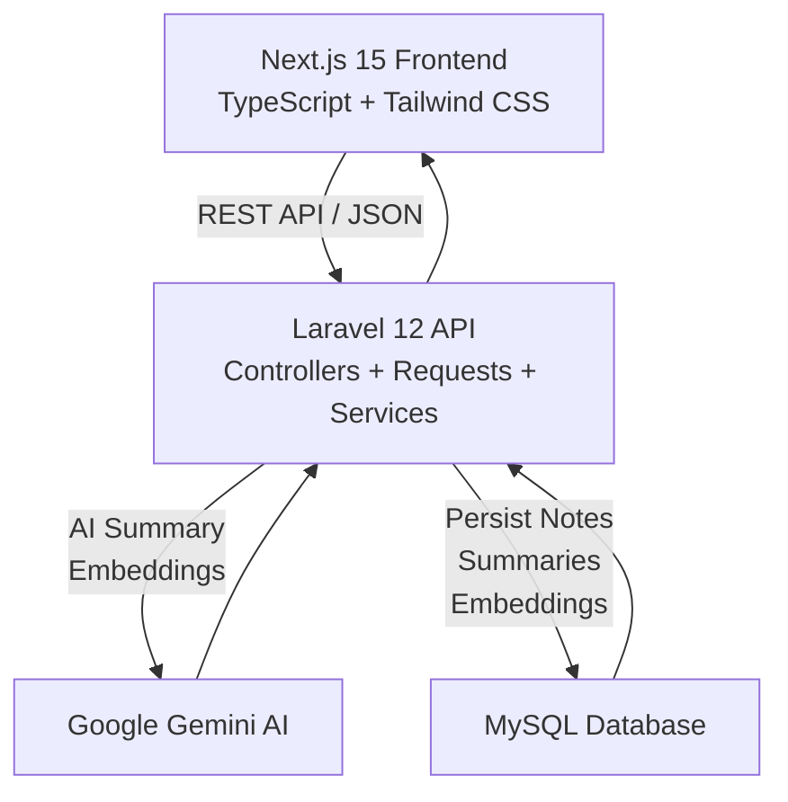
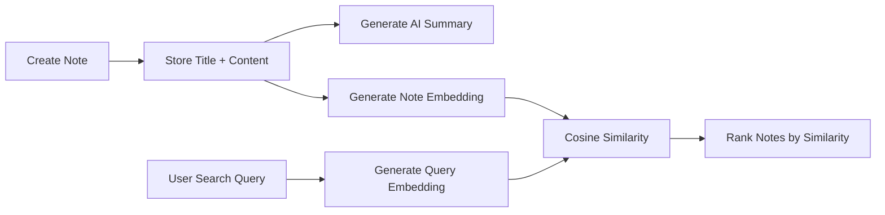
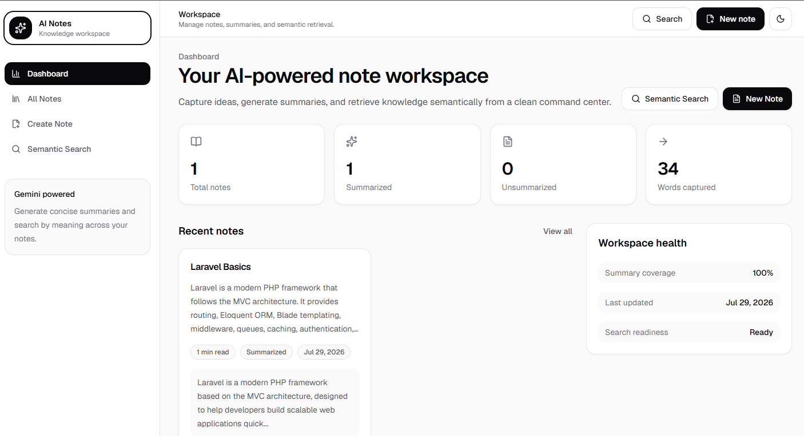
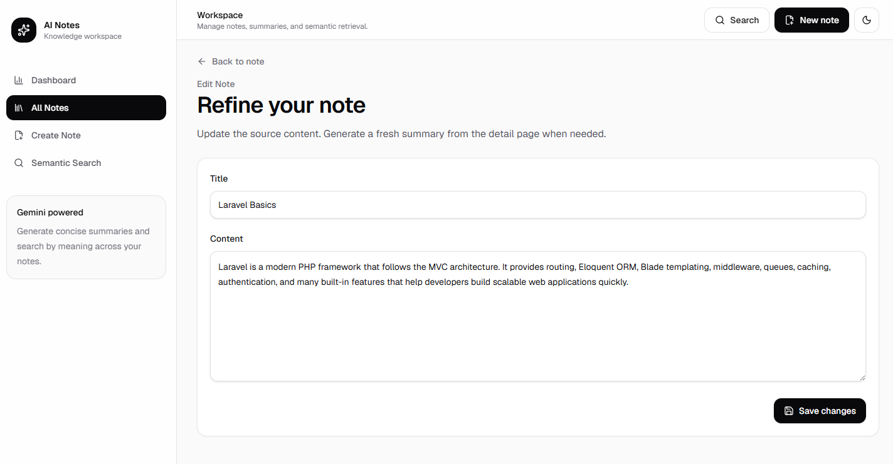
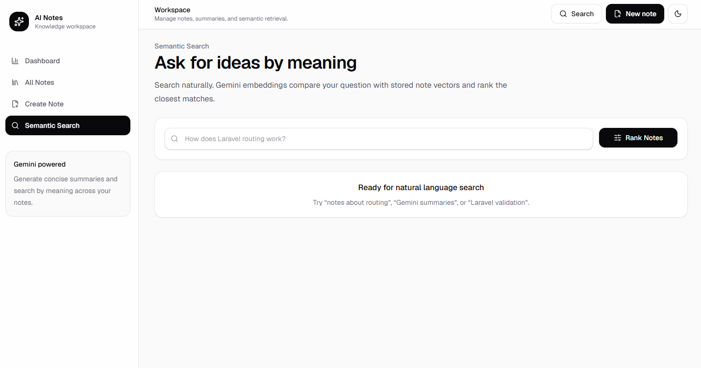
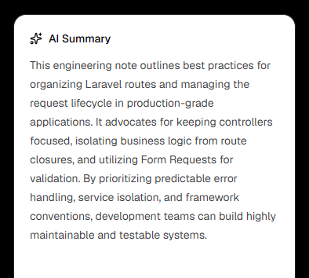
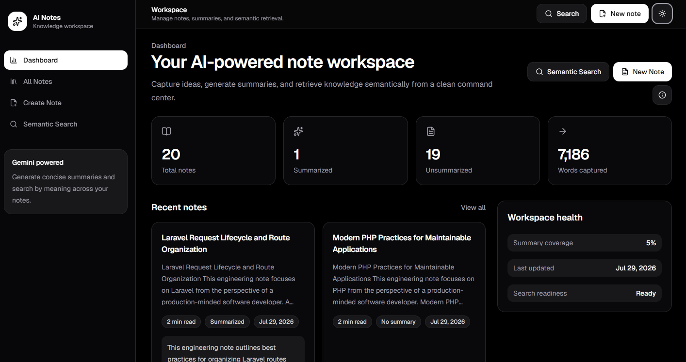

<div align="center">

# 🧠 AI Notes Management System

### A modern full-stack notes workspace powered by AI summaries and semantic search

Built with **Laravel 12**, **Next.js 15**, **Google Gemini AI**, **MySQL**, and a production-style REST architecture.

> Developed as part of the **NVECTA AI Internship Assignment**.
> This is an internship project and is **not** an official NVECTA product.

<br />


</div>

---

## ✨ Overview

**AI Notes Management System** is a portfolio-grade full-stack application for creating, organizing, summarizing, and searching notes with AI.

Traditional notes apps depend on exact keyword matching. This project improves that workflow by combining:

- **AI summarization** to quickly understand long notes.
- **Semantic search** to find notes by meaning instead of exact words.
- **A clean SaaS frontend** that makes the experience feel polished, fast, and recruiter-ready.

> [!NOTE]
> This project demonstrates practical AI integration in a real REST API workflow: database persistence, validation, service layers, frontend state management, and production-style UI patterns.

---

## 🚀 Features

### Backend

| Feature | Description |
|---|---|
| Notes CRUD | Create, read, update, and delete notes through REST endpoints. |
| Form Requests | Laravel request validation for create, update, and semantic search. |
| Service Layer | Dedicated Gemini services for summaries and embeddings. |
| Consistent JSON | API responses use `success`, `message`, and `data` where applicable. |
| Error Handling | AI failures are handled gracefully without exposing internals. |
| MySQL Persistence | Notes, summaries, and embeddings are stored in the database. |

### Frontend

| Feature | Description |
|---|---|
| Dashboard | Statistics for notes, summaries, words captured, and workspace health. |
| Notes Workspace | Browse, filter, paginate, edit, summarize, and delete notes. |
| Create / Edit Pages | React Hook Form + Zod validation with polished inputs. |
| Detail Page | Full note view with AI summary panel and destructive-action dialog. |
| Semantic Search UI | Natural language search with ranked similarity results. |
| Dark Mode | Persistent light/dark theme toggle. |
| Responsive Layout | Sidebar on desktop, mobile navbar on smaller screens. |
| Toasts & States | Sonner notifications, loading skeletons, empty states, and errors. |

### AI Features

| Feature | Powered By | Purpose |
|---|---|---|
| AI Summary | Google Gemini | Convert long note content into concise summaries. |
| Embeddings | Gemini Embeddings API | Convert notes and queries into vector representations. |
| Semantic Search | Cosine Similarity | Rank notes by meaning and relevance. |

---

## 🏗️ Architecture



---

## 🧠 AI Workflow



---

## 🗂️ Folder Structure

```text
AI Notes Management System/
├── backend/
│   ├── app/
│   │   ├── Http/
│   │   │   ├── Controllers/
│   │   │   │   └── Api/
│   │   │   │       └── NoteController.php
│   │   │   └── Requests/
│   │   │       ├── StoreNoteRequest.php
│   │   │       ├── UpdateNoteRequest.php
│   │   │       └── SearchNotesRequest.php
│   │   ├── Models/
│   │   │   ├── Note.php
│   │   │   └── User.php
│   │   ├── Providers/
│   │   │   └── AppServiceProvider.php
│   │   └── Services/
│   │       ├── GeminiEmbeddingService.php
│   │       └── GeminiSummaryService.php
│   ├── bootstrap/
│   │   └── app.php
│   ├── config/
│   │   ├── app.php
│   │   ├── database.php
│   │   └── services.php
│   ├── database/
│   │   ├── migrations/
│   │   │   ├── 2026_07_29_062055_create_notes_table.php
│   │   │   └── 2026_07_29_153535_add_embedding_to_notes_table.php
│   │   └── seeders/
│   │       └── DatabaseSeeder.php
│   ├── routes/
│   │   ├── api.php
│   │   └── web.php
│   ├── tests/
│   │   ├── Feature/
│   │   └── Unit/
│   ├── artisan
│   ├── composer.json
│   └── phpunit.xml
│
├── frontend/
│   ├── src/
│   │   ├── app/
│   │   │   ├── notes/
│   │   │   │   ├── [id]/
│   │   │   │   │   ├── edit/
│   │   │   │   │   │   └── page.tsx
│   │   │   │   │   └── page.tsx
│   │   │   │   ├── create/
│   │   │   │   │   └── page.tsx
│   │   │   │   └── page.tsx
│   │   │   ├── search/
│   │   │   │   └── page.tsx
│   │   │   ├── globals.css
│   │   │   ├── layout.tsx
│   │   │   ├── not-found.tsx
│   │   │   ├── page.tsx
│   │   │   └── providers.tsx
│   │   ├── components/
│   │   │   ├── layout/
│   │   │   ├── notes/
│   │   │   ├── search/
│   │   │   └── ui/
│   │   ├── hooks/
│   │   ├── lib/
│   │   │   ├── api.ts
│   │   │   ├── schemas.ts
│   │   │   └── utils.ts
│   │   └── types/
│   │       └── note.ts
│   ├── public/
│   ├── package.json
│   ├── next.config.ts
│   └── tsconfig.json
│
├── postman/
├── .postman/
└── README.md
```

<details>
<summary><strong>📌 Key Implementation Files</strong></summary>

| File | Purpose |
|---|---|
| `backend/app/Http/Controllers/Api/NoteController.php` | REST controller for CRUD, summary, and semantic search endpoints. |
| `backend/app/Services/GeminiSummaryService.php` | Generates note summaries with Gemini. |
| `backend/app/Services/GeminiEmbeddingService.php` | Generates embeddings and calculates cosine similarity. |
| `backend/app/Models/Note.php` | Note model with fillable fields and embedding cast. |
| `frontend/src/lib/api.ts` | Centralized Axios API client. |
| `frontend/src/hooks/use-notes.ts` | Shared frontend note loading and action logic. |
| `frontend/src/components/notes/note-card.tsx` | Reusable note preview card. |
| `frontend/src/app/search/page.tsx` | Semantic search experience. |

</details>

---

## 🛠️ Technology Stack

| Layer | Technology | Why It Was Used |
|---|---|---|
| Frontend | Next.js 15 App Router | Modern React routing, layouts, and production build pipeline. |
| Frontend Language | TypeScript | Safer API contracts and scalable UI development. |
| Styling | Tailwind CSS | Fast, responsive, design-system-friendly styling. |
| UI Motion | Framer Motion | Smooth transitions and polished interactions. |
| Icons | Lucide React | Clean, consistent SaaS-style iconography. |
| Forms | React Hook Form + Zod | Type-safe validation and ergonomic form state. |
| Toasts | Sonner | Minimal, premium user feedback. |
| API Client | Axios | Centralized HTTP layer for REST communication. |
| Backend | Laravel 12 | Robust REST API, validation, services, and migrations. |
| Database | MySQL | Reliable relational persistence for notes and AI output. |
| AI | Google Gemini | Summary generation and embeddings. |
| API Style | REST + JSON | Simple, predictable frontend-backend contract. |

---

## 🖼️ Screenshots

> Add screenshots to the `/screenshots` directory using the filenames below.

| Dashboard | Notes |
|---|---|
|  |  |

| Semantic Search | AI Summary |
|---|---|
|  |  |

| Dark Mode |
|---|
|  |

---

## ⚙️ Installation Guide

### Prerequisites

| Tool | Recommended |
|---|---|
| PHP | 8.2+ |
| Composer | Latest stable |
| Node.js | 18+ |
| npm | Latest stable |
| MySQL | 8+ |
| Gemini API Key | Google AI Studio |

---

### Backend Setup

```bash
cd backend
composer install
cp .env.example .env
php artisan key:generate
php artisan migrate
php artisan serve
```

Backend runs at:

```text
http://localhost:8000
```

---

### Frontend Setup

```bash
cd frontend
npm install
npm run dev
```

Frontend runs at:

```text
http://localhost:3000
```

---

## 🔐 Environment Variables

### Backend `.env`

```env
APP_KEY=

DB_DATABASE=nvecta_notes
DB_USERNAME=root
DB_PASSWORD=

GEMINI_API_KEY=
GEMINI_MODEL=gemini-embedding-2
```

> [!IMPORTANT]
> Do not commit real API keys or database credentials. Keep secrets in local `.env` files only.

### Frontend `.env.local`

```env
NEXT_PUBLIC_API_URL=http://localhost:8000/api
```

---

## 📡 API Endpoints

| Method | Endpoint | Description | Body |
|---|---|---|---|
| `GET` | `/api/notes` | List all notes, latest first. | - |
| `POST` | `/api/notes` | Create a note. | `{ "title": "...", "content": "..." }` |
| `GET` | `/api/notes/{id}` | Fetch a single note. | - |
| `PUT/PATCH` | `/api/notes/{id}` | Update a note. | `{ "title": "...", "content": "..." }` |
| `DELETE` | `/api/notes/{id}` | Delete a note. | - |
| `POST` | `/api/notes/{id}/summary` | Generate and store an AI summary. | - |
| `POST` | `/api/notes/search` | Semantic search using Gemini embeddings. | `{ "query": "How does Laravel routing work?" }` |

### Example API Response

```json
{
  "success": true,
  "message": "Notes retrieved successfully.",
  "data": []
}
```

---

## 🧪 Testing

### Backend

```bash
cd backend
php artisan optimize:clear
php artisan route:list --path=api/notes
php artisan test
```

### Frontend

```bash
cd frontend
npm run lint
npm run build
```

---

## 🧭 User Journey

| Step | Action | Result |
|---|---|---|
| 1 | Create a note | Title and content are stored in MySQL. |
| 2 | Generate summary | Gemini creates a concise summary and Laravel stores it. |
| 3 | Search naturally | Gemini creates a query embedding. |
| 4 | Compare vectors | Laravel computes cosine similarity against note embeddings. |
| 5 | View ranked results | Frontend displays notes sorted by relevance score. |

---

## 🔮 Future Improvements

- Authentication and protected user accounts
- Multi-user workspaces
- Note tags and categories
- Export notes to PDF / Markdown
- Voice notes and speech-to-text
- RAG-based chat over notes
- Dedicated vector database such as Pinecone, Qdrant, or pgvector
- Background jobs for embedding generation
- Rich text editor
- Note sharing and collaboration

---

## 🎓 Learning Outcomes

This project strengthened practical experience in:

- Designing REST APIs with Laravel 12
- Structuring controllers, form requests, services, and models
- Integrating Google Gemini AI into a real application
- Implementing semantic search with embeddings and cosine similarity
- Persisting AI-generated summaries and embeddings
- Building a modern Next.js 15 frontend with TypeScript
- Creating reusable UI components and hooks
- Managing loading, empty, error, toast, and confirmation states
- Connecting a production-style frontend to a Laravel API
- Thinking through full-stack architecture from database to UI

---

## 🏢 Developed For

Developed as part of the **NVECTA AI Internship Assignment**.

> [!WARNING]
> This repository is an internship assignment/project and is **not** an official NVECTA product.

---

## 👤 Author

| Field | Link |
|---|---|
| Name | Your Name |
| LinkedIn | https://linkedin.com/in/your-profile |
| GitHub | https://github.com/your-username |
| Portfolio | https://your-portfolio.com |

---

## 📄 License

This project is licensed under the **MIT License**.

```text
MIT License

Copyright (c) 2026 Your Name

Permission is hereby granted, free of charge, to any person obtaining a copy
of this software and associated documentation files, to deal in the Software
without restriction, including without limitation the rights to use, copy,
modify, merge, publish, distribute, sublicense, and/or sell copies of the Software.
```

---

<div align="center">

### Thanks for visiting this project.

If you are a recruiter, interviewer, or reviewer, this repository demonstrates a full-stack AI workflow with practical product thinking, clean API design, and a polished modern frontend.

⭐ Star the repository if you find it useful.

</div>
